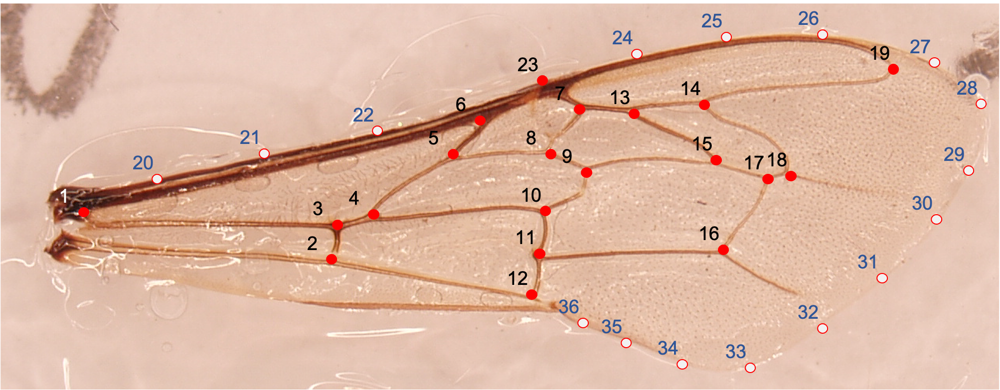
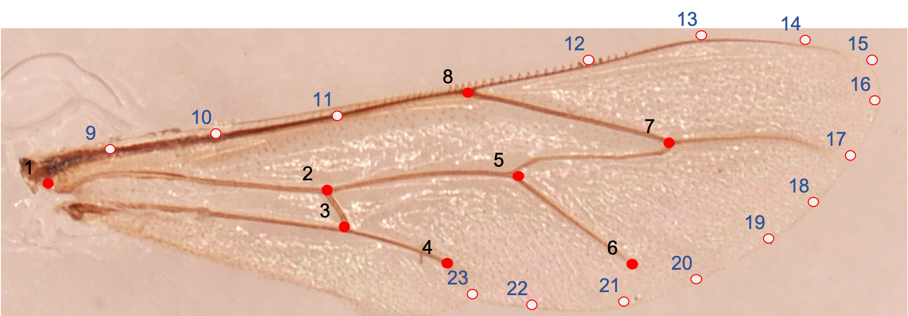

```{r, warning=F, echo=F, include=F}
# special case for PDF and table as they otherwise wont work
if(knitr::is_latex_output()){
  options(knitr.table.format = "latex")
} else {
  options(knitr.table.format = "html")
}
```

```{r load-files, warning=F, echo=F, include=F}
source("partials/setup.R", local = knitr::knit_global())
source("partials/analysis.R", local = knitr::knit_global())

```

# Introduction

European Honeybees, *Apis mellifera*, are highly efficient pollinators of crops and wild flowers and hence provide exceptionally important economical and ecosystem services for us humans [@kearns1998; @gallai2009]. There are many subspecies and knowledge about origin and taxonomic differences and local distribution are crucial too understand them [@ruttner1988; @phylogen2020]. Sadly, even though we learn each day more about importance of insect in our ecosystem a alarming decline of wild pollinators can be seen over the last years [@hallmann2017; @sánchez-bayo2019]. The reasons for the decline seem manifold: parasites; pathogens; environmental pollution; rapid climate change, loss of insect friendly habitats etc. [@biesmeijer2006; @potts2010; @goulson2013; @woodcock2017].

In this small paper, which is part of the homework assessment for the course "Mod. Multivariate Biostatistik und geometrische Morphometrie" at the University of Graz I try to apply basic geometric morphometrics practices to differentiate possible subpopulations or lineages of *A. m.,* similar real studies were done before and showed great success [@kandemir2009; @tofilski2008; @francoy2006]. These studies and in my homework the fore- and backwing of *A. m.* are used, as they are a easy to dissect and photograph and posses a high degree of variability in wing venation [@grimaldi2005].

The main goal was to get a better understand for geometric morphometrics and how to use it in various biology questions. With the help of geometric morphometrics we can not only measure morphological similarity or differences but also put the results in the form of actual shapes in context [@mitteroecker2009]. Other advantages of geometric morphometrics are that the data can easily collected in from digital images and size is mathematical removed with the procusters method to focus purely on shape or with size-and-shape we analyze the form [@mitteroecker2009; @mitteroecker2013]. This would not be possible with traditional morphometrics, which is only a indirect capture of the shape.

# Material and Methods

In total 52 scanned forewing and backwing images were available to me, of these, ten were given by Dr. Robert Brodschneider, which were collected in 2011 in Graz by a student of his. Dr. Juergen Herler, University of Vienna, did contribute the other images, which were collected in the year 2009 from colonies in Graz, Frohnleiten and Vienna. No further information on the images were given. Not all images could be used as I only used wings were all landmarks were visible also the backwing scans for Graz 2011 had a really poor quality and were dropped and not analyzed.

Landmarks (LM) were set on homologous points either at the end of wing veins or were two or more veins met, this was done with the tps software package [@rohlf2015], the set landmarks can be seen in figure \@ref(fig:landmarkImage). Analysis was performed in R with the RStudio IDE and tidyverse [@r2020; @RStudio2021; @tidyverse2019]. Generalized procuster analysis (GPA), which centers the shape on the origin, scales all shape to the unit size of one and tries to minimize least square distance by roation [@mitteroecker2009], was performed with the @geomorph2021a package. Also the setting of sliding landmarks and thin-plate spline (TPS) deformation grids were done with @geomorph2021a. The resulting aligned procuster coordinates, which represents the shape for each specimen, were exploratory analyzed with principal component analysis (PCA) and also used to extract the point-distance [@raster2020] to calculate the traditional morphometrics cubital index (CI) based on @goetze1959. For the multiple group linear discriminant analysis or canonical variate analysis (CVA) the first ten principal components (PC) were used, accuracy of classification was tested with leave-one-out cross-validation [@MASS2002].

(ref:landmarkImage) Example of forewing (left) and backwing (right) image, with landmark positions. White colored points with blue numbers represent the appr. location of the sliding landmarks, which define the outline of the wing.

```{r landmarkImage, fig.cap='(ref:landmarkImage)', out.width='40%', fig.show='hold', include=TRUE}


```

# Results

(ref:csPlot) Boxplot distribution of the centroid size. Comparison between samples forewing and backwing respectively. Backwing is missing for "Graz 2011" due to poor image quality.

```{r csPlot, fig.cap='(ref:csPlot)', out.width='70%', include=TRUE}
knitr::include_graphics("images/csPlot.pdf")
```

The measure of overall size with centroid size, which is the sum of distances from landmarks to centroid, shows clear inter-sample difference between all groups for the forewing, see figure \@ref(fig:csPlot) - left. The sample "Graz 2011" shows on average lowest centroid size. Highest on average, but also with widest standard deviation, is the sample "Frohnleiten 2009". The backwing shows also difference between the groups, sample "Graz 2011" is missing due to poor image quality, see figure \@ref(fig:csPlot) - right. For the backwing the sample "Frohnleiten 2009" has the smallest centroid size on average, compared to the other two groups.

(ref:ciPlot) Boxplot distribution of the traditional forewing cubital index (CI) [@goetze1959]. The CI was calculated by the point distance between LM 15-17 divided by the point distance between LM 17-18, see figure \@ref(fig:landmarkImage).

```{r ciPlot, fig.cap='(ref:ciPlot)', out.width="60%", include=TRUE}
knitr::include_graphics("images/ciPlot.pdf")
```

The comparison of distribution and central tendency of the traditional cubital index (CI) [@goetze1959] is similar between the samples, see figure \@ref(fig:ciPlot). No clear inter-sample differentiation of all groups, with CI alone, would be possible.

(ref:pcPlot) Aligned procuster coordinates for all specimens, after GPA. Links (red lines), to better visualize the shape, are connected on the mean coordinates.

```{r pcPlot, fig.cap='(ref:pcPlot)', include=TRUE}
knitr::include_graphics("images/pcPlot.pdf")
```

The landmark (LM) position after GPA for all specimens can be seen in fig. \@ref(fig:pcPlot). Backwing shows more variation of the aligned procuster coordinates, compared to the forewing.

(ref:fwPCA) Forewing PC1 and PC2 on aligned procuster coordinates and TPS of the extrapolated PC axis difference to the mean reference shape of all specimen.

```{r fwPCA, fig.cap='(ref:fwPCA)', out.width='80%', include=TRUE}
knitr::include_graphics("images/fwPCA.pdf")
```

The PCA for the forewing separates on the first PC the "Graz 2011" sample from the rest, see \@ref(fig:fwPCA). The first PC does already explain over a third of the total variance of all principal components. The first and second combined already over 50% of the total variance, see fig. The shape change to the mean reference for the first PC indicates that the sample from "Graz 2011" has a more slimmer shape. Also the second PC has the same overall shape difference, but vein distances between other landmarks are different.

(ref:bwPCA) Backwing PC1 and PC2 on aligned procuster coordinates and TPS of the extrapolated PC axis difference to the mean reference shape of all specimen.

```{r bwPCA, fig.cap='(ref:bwPCA)', out.width='80%', include=TRUE}
knitr::include_graphics("images/bwPCA.pdf")
```

As for the backwing only the samples from the year 2009 are included and also only a subset as not all backwings were complete. All groups are overlapping in the first two dimensions, which cumulative can explain 66% of the total variance, see fig. \@ref(fig:bwPCA). The shape of the first PC differentiate mainly in total vertical volume of the radial cell. Both first and second PC are predominately defined by the difference of sliding landmarks.

(ref:CVA) Exploratory CVA based on the 1-10 PC for forewing and backwing respectively. The percent of captured between-group variance is given on the axes.

```{r CVA, fig.cap='(ref:CVA)', include=TRUE}
knitr::include_graphics("images/cvaPlot.pdf")
```

(ref:densCVA) Kernel density estimate of the samples for the first CVA dimension.

```{r densCVA, fig.cap='(ref:densCVA)', out.width='80%', include=TRUE}
knitr::include_graphics("images/densPlot.pdf")
```

With the CVA we can improve our differentiation of samples. Most of the between-sample variance is captured by the first dimension in both cases (fig. \@ref(fig:CVA)-\@ref(fig:densCVA)). The accuracy of the CVA classification for the forewing `r round(fwJackExplained, 2)` was better as for the backwing `r round(bwJackExplained, 2)`, see table \@ref(tab:fwCVA) and \@ref(tab:bwCVA), but this may be biased because for the backwing the sample "Graz 2011" is missing.

```{r fwCVA, include=T}
kbl(
  fwConfJack, 
  booktabs = TRUE, row.names = TRUE,
  caption = paste0("CVA leave-one-out cross-validation for the forewing, total accuracity ", round(fwJackExplained, 2), "."),
  )
```

```{r bwCVA, include=T}
kbl(
  bwConfJack, 
  booktabs = TRUE, row.names = TRUE,
  caption = paste0("CVA leave-one-out cross-validation for the backwing, total accuracity ", round(bwJackExplained, 2), "."),
  )
```

# Discussion

The centroid size (CS) is clearly different between our samples, see fig. \@ref(fig:csPlot). The CS in winged insects could be seen as proxy for the actual body size, which was found in a study for damselflies [@outomuro2011]. There are multiple reason why the absolute body size or the wing sizes may differ. One explanation could be genetics and as all worker bees in a colony are sisters the intra-sample variation is lower. Another explanation would be the size of the comb cells which is influenced by the cell size of the foundation made available by the beekeeper and also the age of combs, as for older combs the diameter of cells decreased, due to accumulated cocoons and fecal materials [@berry2001]. It could also indicate environment conditions as better nutrients availability probably results in more fed larvae or a visual precursor for underlying health conditions, as Varroosis can lead to deformation of abdomen or wings [@genersch2010; @morawetz2019].

If we look at one well known traditional morphometrics measurement of the cubital index (CI) [@goetze1959], we can separate our sample into two groups, see fig. \@ref(fig:ciPlot). With "Graz 2011" and "Frohnleiten 2009" having a higher CI on average and "Graz 2009" and "Wien 2009" a lower one All CI are in range for *A. m. carnica*, based on @ruttner1988. The traditional morphometrics includes normally more than one parameter, as in my example [@ruttner2000]. A study on direct comparison between geometric morphometrics and traditional morphometrics showed only marginal better results for the geometric morphometrics approach [@tofilski2008]. Nowadays modern genetic methods have shown that traditional morphometrics alone is not always good enough to differentiate subspecies in honeybees [@groeneveld2020].

In the principal component analysis (PCA) each point represent a unique shape of our specimen (shape space). The PCA does only differentiate the sample from "Graz 2011", all other samples are more or less overlapping in the shown PCs for both fore- and backwing, see fig. \@ref(fig:fwPCA)-\@ref(fig:bwPCA). With the extrapolated TPS for the forewing, we see that most of the variance is explained by the height and top outline of the beewing. As the sample from "Graz 2011" seem to have a more round outline and a thinner shape compared to the other samples. The difference between the first and second PC is not as clear on the first glance as the overall theme is the same, with slimmer and wider shape, but there are few LM different, which does mean different wing vein lengths. Some sliding LM seem to also dominate the difference, the same can be said for the backwing. If the sliding LM differences represent a real shape difference or are only an artifact needs further investigation. Especially the backwing difference along the PC axes seems to be predominately defined by the sliding landmarks of the bee wing outline.

The classification with CVA (fig. \@ref(fig:CVA)), which maximizes the variance between sample means to the pooled variance within the samples, based on the first ten PC dimensions, for fore- and backwing respectively, did have an accuracy of prediction with leave-one-out cross-validation for the forewing of 71% and for the backwing 60%, see table \@ref(tab:fwCVA)-\@ref(tab:bwCVA). The higher accuracy may not only due to better differentiation for the forewing per sé, with more LM and therefore more possibility of variation, but also due to the more different "Graz 2011" sample, which already did differentiate based on the first dimension in the PCA.

Even though, I cannot differentiate perfectly between given samples, I have to say that without background information on the collected specimens, it is hard to tell if I even should see a difference, they could also be strongly related colonies in terms of genetic or ecological conditions. It seems so far that geometric morphometrics was only used as tool for differentiation between subspecies or populations and no direct effect or cause of the beewing differences were discussed [@kandemir2009; @tofilski2008; @francoy2006]. The missing discussion and visualization of shape is a great miss in my opinion, as it is one of the great benefits of geometric morphometrics [@mitteroecker2009]. If the goal is only differentiation of populations based on ancestral history modern machine learning approaches on nucleotide polymorphisms seem to be very effective and highly efficient [@momeni2021]. Ofcourse here the advantage of geometric morphometrics would be the cheaper and more accessibility of the needed tools [@francoy2006].

# References {.unnumbered}
